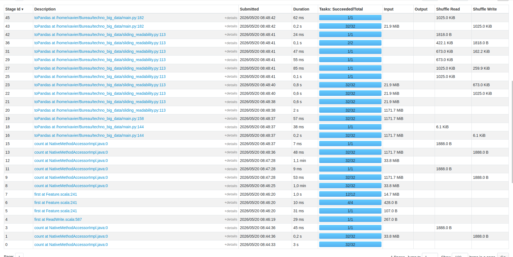

```{python}
#| include: false
import os
import pandas as pd
import numpy as np
import plotly.express as px
import plotly.graph_objects as go
from IPython.display import display, Markdown
import warnings
warnings.filterwarnings("ignore")

try:
    import pyarrow as pa
    import pyarrow.orc as orc_module
    HAS_PYARROW = True
except ImportError:
    HAS_PYARROW = False

PARQUET_RAW       = "data/parquet/raw_corpus"
PARQUET_ANNOTATED = "data/parquet/annotated_corpus"
PARQUET_SLIDING   = "data/parquet/sliding_readability"
ORC_STYLOMETRY    = "data/orc/stylometry"
SRC_DIR           = "."

def read_parquet(path, filters=None):
    return pd.read_parquet(path, filters=filters)

def read_orc(path):
    orc_files = [os.path.join(path, f) for f in os.listdir(path) if f.endswith(".orc")]
    if HAS_PYARROW:
        try:
            return pa.concat_tables([orc_module.read_table(f) for f in orc_files]).to_pandas()
        except Exception:
            pass
    return pd.concat([pd.read_orc(f) for f in orc_files], ignore_index=True)

df_raw       = read_parquet(PARQUET_RAW)
df_annotated = read_parquet(PARQUET_ANNOTATED)
df_sliding   = read_parquet(PARQUET_SLIDING)
df_stylo     = read_orc(ORC_STYLOMETRY)

AUTHORS    = sorted(df_annotated["author"].unique())
COLORS     = px.colors.qualitative.Plotly
COLOR_MAP  = {a: COLORS[i % len(COLORS)] for i, a in enumerate(AUTHORS)}
SYMBOL_MAP = {"romantic": "circle", "realism": "x"}
TEMPLATE   = "plotly_white"

stylo  = df_stylo.copy()
books  = df_annotated[["id","title","author","genre","flesch_score","km_score","word_count","sentence_count"]].copy()
books["avg_sent_len"] = books["word_count"] / books["sentence_count"].clip(lower=1)
sliding = df_sliding.copy()

zipf_path = "data/zipf.csv"
has_zipf  = os.path.exists(zipf_path)
if has_zipf:
    zipf_pdf = pd.read_csv(zipf_path)

seg_path = "data/segmentation.csv"
has_seg  = os.path.exists(seg_path)
if has_seg:
    seg_pdf = pd.read_csv(seg_path)
else:
    seg_cols = [c for c in df_annotated.columns if "dialog" in c]
    has_seg  = len(seg_cols) > 0
    if has_seg:
        seg_pdf = df_annotated.groupby(["author","genre"])[seg_cols].mean().reset_index()
```

---
## Corpus

---

## Sauvegarde


| Table | Format |
|---|---|---|
| raw_corpus | Parquet |
| annotated_corpus | Parquet |
| sliding_readability | Parquet |
| stylometry | ORC |
| zipf / segmentation | CSV |

---

## Kandel-Moles moyen par auteur

```{python}
fig = px.bar(
    stylo, x="author", y="avg_km", color="genre",
    barmode="group",
    color_discrete_map={"romantic":"#636EFA","realism":"#EF553B"},
    text_auto=".1f",
    labels={"author":"Auteur","avg_km":"Score Kandel-Moles","genre":"Genre"},
)
fig.update_layout(template=TEMPLATE, legend_title="Genre",
                  margin=dict(t=20), height=430)
fig.show()
```

---

## Complexité structurelle par auteur

```{python}
pdf = (
    books.groupby(["author", "genre"])
    .agg(
        avg_sentences=("sentence_count", "mean"),
        avg_words=("word_count", "mean"),
    )
    .reset_index()
)

fig = px.scatter(
    pdf,
    x="avg_sentences",
    y="avg_words",
    color="genre",
    size="avg_words",
    hover_name="author",
    title="Complexité structurelle par auteur — Mots × Phrases (moyenne par texte)",
    labels={
        "avg_sentences": "Nb moyen de phrases par texte",
        "avg_words"    : "Nb moyen de mots par texte",
        "genre"        : "Genre",
    },
)
fig.update_layout(
    template=TEMPLATE,
    legend_title="Genre",
    margin=dict(t=60),
    height=430,
)
fig.show()
```

---

## Lisibilité glissante — Flesch (fenêtre 500 tokens)

```{python}
s500      = sliding[sliding["window_size"] == 500].copy()
first_ids = s500.groupby("author")["id"].first().reset_index()
sample    = s500.merge(first_ids, on=["author","id"])

fig = px.line(
    sample, x="window_index", y="flesch",
    color="author", line_dash="genre",
    color_discrete_map=COLOR_MAP,
    labels={"window_index":"Fenêtre","flesch":"Score Flesch",
            "author":"Auteur","genre":"Genre"},
)
fig.add_hline(y=70, line_dash="dot", line_color="green", opacity=0.4)
fig.add_hline(y=30, line_dash="dot", line_color="orange", opacity=0.4)
fig.update_layout(template=TEMPLATE, legend_title="Auteur / Genre",
                  margin=dict(t=20), height=430)
fig.show()
```

---

## Loi de Zipf par auteur

```{python}
if has_zipf:
    genre_avg = (
        zipf_pdf.groupby(["author","rank"])[["log_freq"]]
        .mean().reset_index()
    )
    fig = px.line(
        genre_avg, x="rank", y="log_freq", color="author",
        log_x=True,
        labels={"rank":"Rang (log₁₀)","log_freq":"Fréquence log₁₀","genre":"Genre"},
    )
    fig.update_layout(template=TEMPLATE, legend_title="Genre",
                      margin=dict(t=20), height=430)
    fig.show()
else:
    display(Markdown("> `data/zipf.csv` introuvable — ajoutez `zipf_pdf.to_csv('data/zipf.csv', index=False)` dans `main.py`"))
```

---

## Segmentation dialogue / narration

```{python}
if has_seg and "avg_dialog_ratio" in seg_pdf.columns:
    fig = px.bar(
        seg_pdf, x="author", y="avg_dialog_ratio",
        color="genre", barmode="group",
        color_discrete_map={"romantic":"#636EFA","realism":"#EF553B"},
        text_auto=".1%",
        labels={"author":"Auteur","avg_dialog_ratio":"Ratio dialogue","genre":"Genre"},
    )
    fig.update_yaxes(tickformat=".0%")
    fig.update_layout(template=TEMPLATE, legend_title="Genre",
                      margin=dict(t=20), height=430)
    fig.show()
else:
    display(Markdown("> `data/segmentation.csv` introuvable"))
```

---

## Spark UI — Stages



---